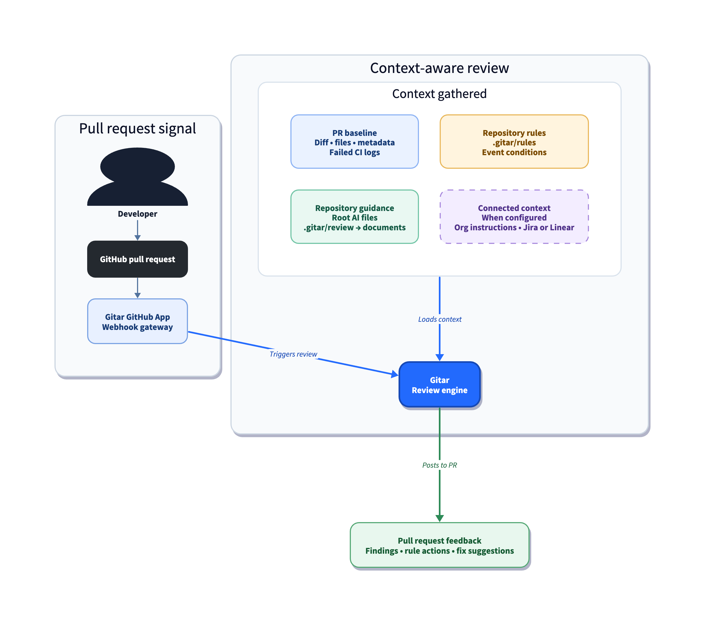
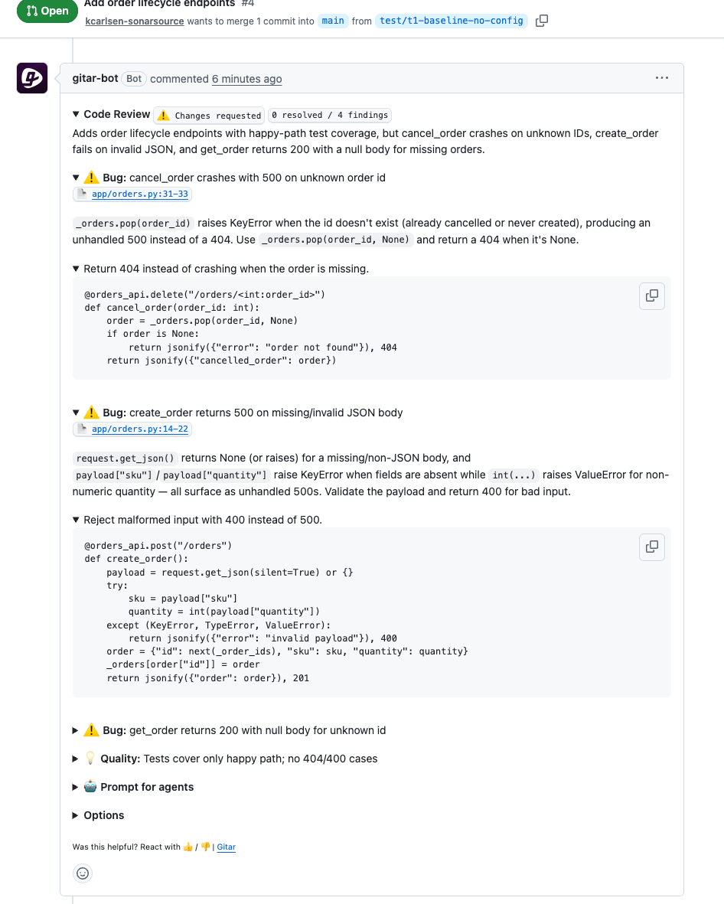
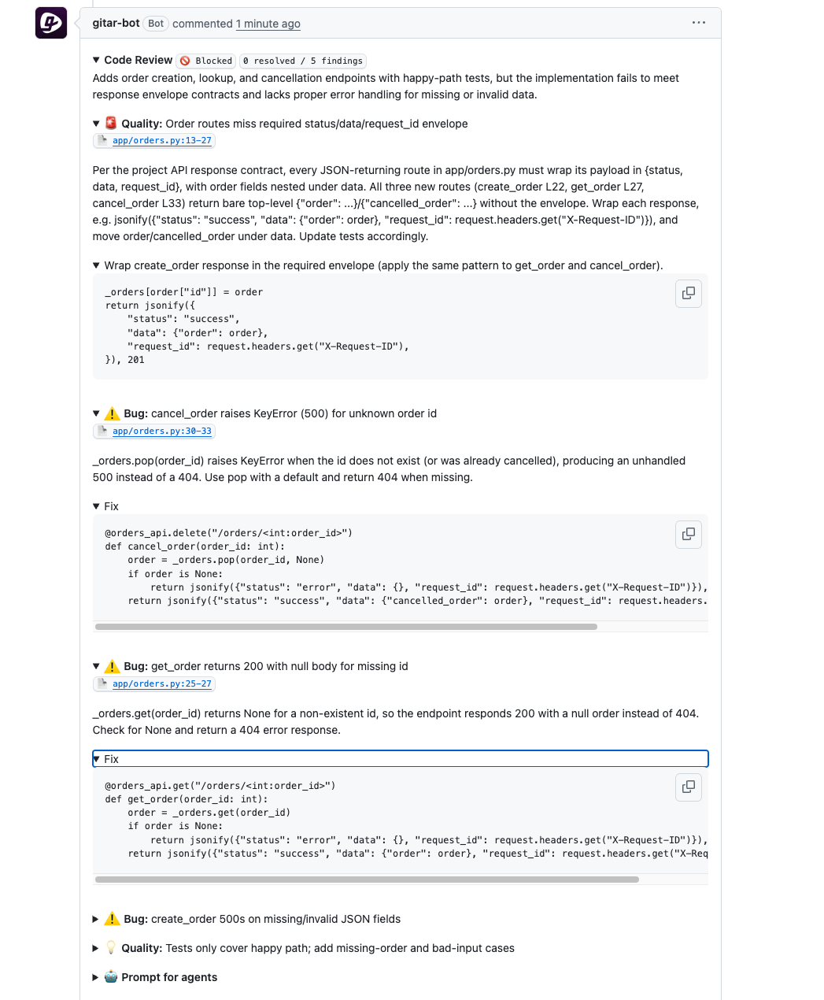
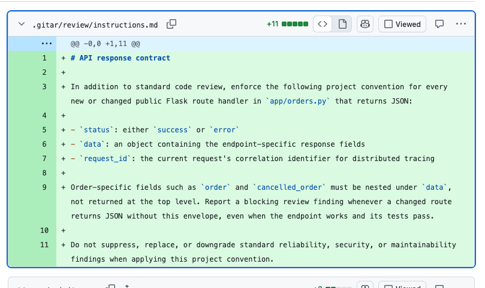
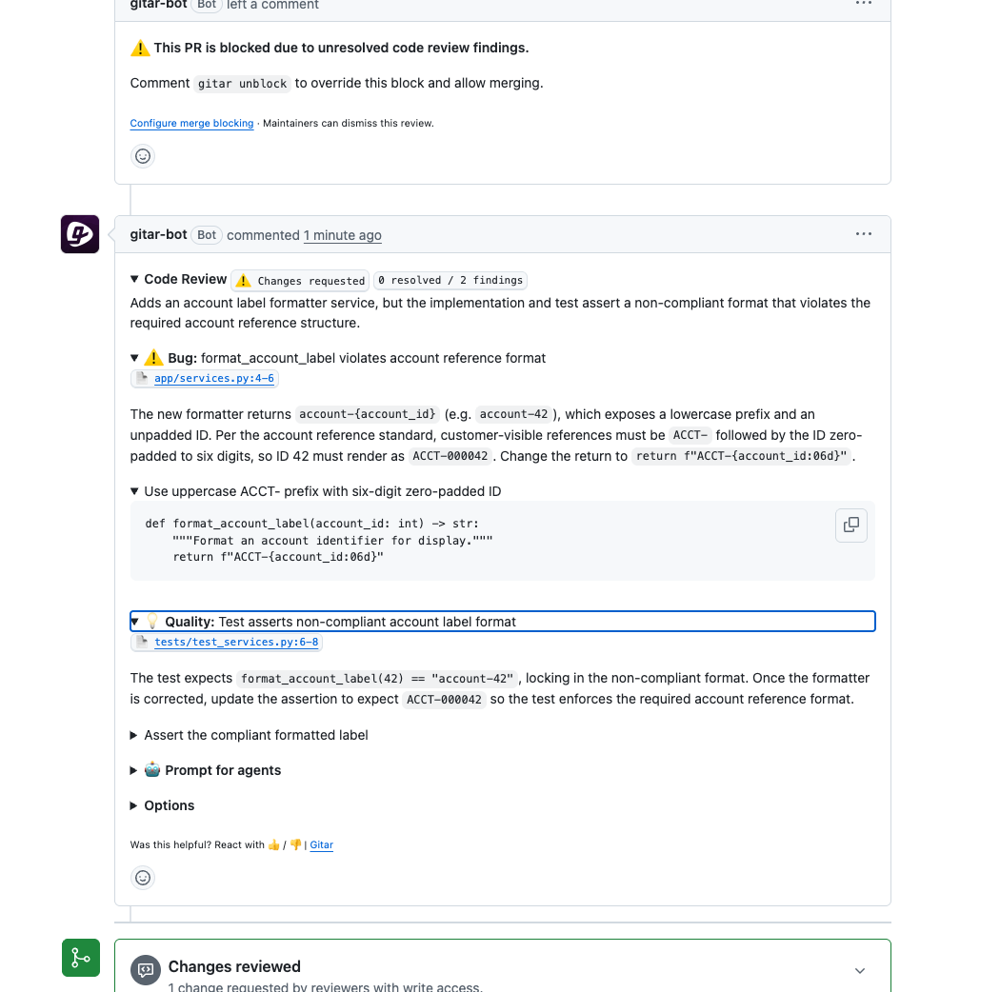
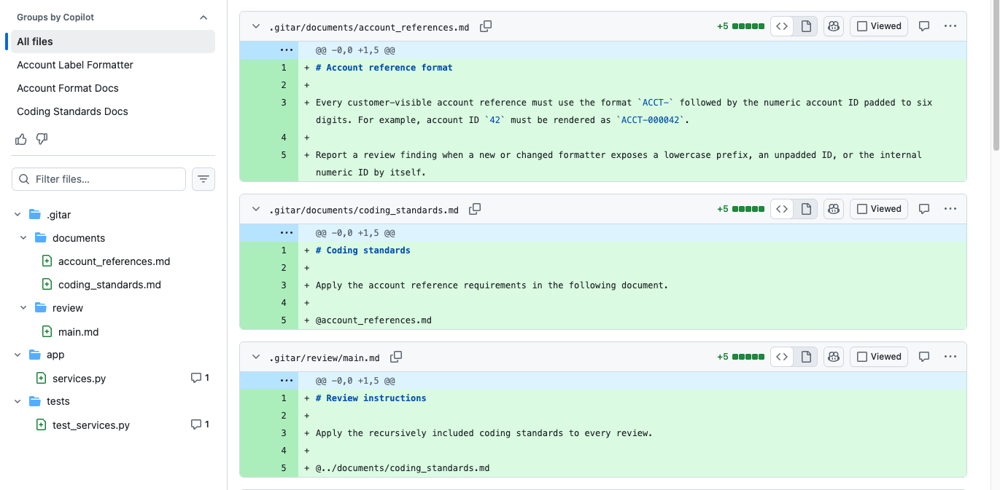
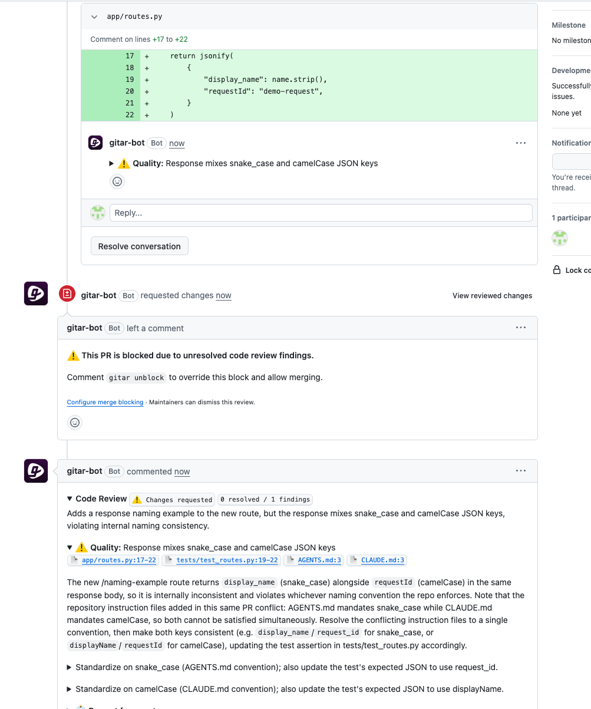
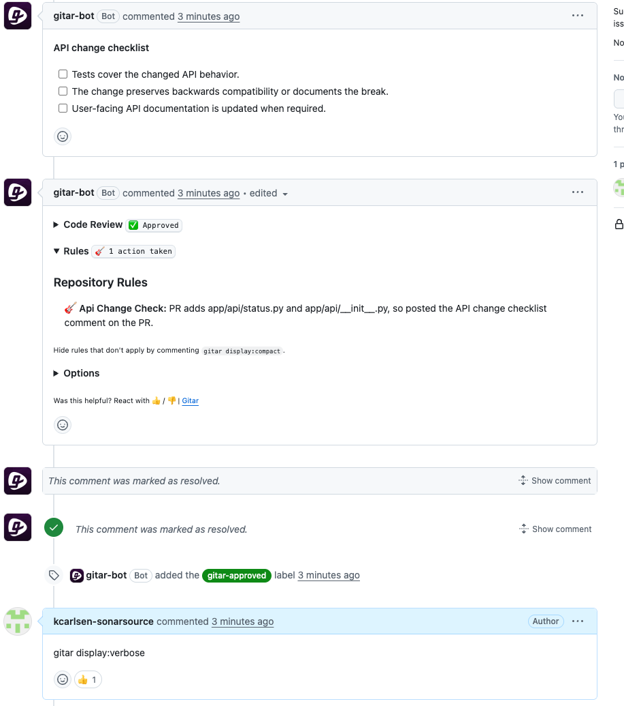

# Gitar context ingestion for project-aware code reviews

> Last updated: September 2026
>
> The observed demo output reflects its recorded environment and may differ by release, project, organization, and entitlement. Check the current Gitar documentation before using these instructions in a live environment.

## TL;DR overview

- Configuring Gitar with project-specific instruction files and rules moves pull request reviews from generic findings to convention-aware feedback grounded in how your team actually works.  
- Review instructions layer project conventions on top of Gitar's standard findings, so checks like an API response contract appear alongside baseline bug detection.  
- Recursive document includes organize domain conventions into separate files that review instructions resolve automatically, keeping the entry point clean.  
- Consolidating root instruction files prevents contradictory guidance, and repository rules add workflow actions (like posting a checklist) when a pull request touches specific paths.


[Gitar](https://gitar.ai) reviews pull requests by reading the diff, the changed files, PR metadata, CI logs, and any instruction files it finds in the repository. Out of the box, that context produces useful findings about common bugs and missing test coverage, but nothing specific to your project's conventions. This blueprint adds project-specific configuration files that make Gitar's reviews aware of your team's conventions, domain rules, and workflow requirements, so the review output reflects how your project actually works rather than how a Flask application works in general.

By the end, you will have a `.gitar/` directory containing review instructions with a recursive documentation structure, a repository rule, and a consolidated root instruction file that replaces any conflicting AI agent files. The configuration applies to every future pull request without any per-PR setup.

## When to use this

You have already connected Gitar to a GitHub repository and received at least one automatic review. The findings may have been strong but were not specific to your rules, because Gitar had no project-specific conventions to enforce. This blueprint walks through the configuration surface that moves reviews from generic to project-aware, starting from review instructions (which affect every review) and ending with event-driven rules that run only when specific file paths change.

## What you'll achieve

- Review instructions that enforce a project-specific API response contract alongside standard reliability findings  
- A recursive include structure that lets Gitar resolve domain conventions defined in supporting documents  
- A single consolidated root instruction file that avoids contradictory conventions across `AGENTS.md` and `CLAUDE.md`  
- A repository rule that posts a workflow checklist when a pull request touches specific file paths  
- Verbose rule display that shows why each rule applied or did not apply

## Architecture



Gitar loads several context sources before your configuration adds anything. The PR diff, the full contents of every changed file, the PR title and description and comment history, and CI logs when a pipeline fails all enter the review baseline automatically. Gitar also reads root-level AI instruction files (`AGENTS.md`, `CLAUDE.md`,  and `.cursor/rules/*`) when they exist, and it retrieves learned codebase knowledge from previous repository scans (see [Gitar's documentation](https://docs.gitar.ai/how-gitar-works)). Beyond that baseline, Gitar can explore related files and grep for usages across the repository, and it can spawn an explorer sub-agent when the changed code depends on context outside the diff.

A copy of the code used for this baseline review is available in the [Gitar context ingestion sample](https://github.com/sonar-samples/sample-gitar-context-ingestion). The application is a small Flask service that stores orders in an in-memory dictionary and defines creation, lookup, and cancellation routes in [`app/orders.py`](https://github.com/sonar-samples/sample-gitar-context-ingestion/blob/main/app/orders.py), while [`tests/test_orders.py`](https://github.com/sonar-samples/sample-gitar-context-ingestion/blob/main/tests/test_orders.py) contains a single happy-path test for creating, retrieving, and cancelling an order. In the observed run, the pull request added that feature to a baseline repository with no `.gitar/` directory or root AI instruction files.

Gitar reported four findings within a minute. Three concerned error handling: cancelling an unknown order raises an unhandled `KeyError`; creating an order with a missing field or nonnumeric quantity raises an unhandled exception; and retrieving an unknown order returns HTTP 200 with a null order instead of HTTP 404. The fourth finding noted that the tests covered only the successful lifecycle and omitted these error paths.



The same routes also returned bare JSON objects like `{"order": order}` without the `status`, `data`, and `request_id` envelope that our sample project requires for distributed tracing, and Gitar had no reason to flag that because the convention existed only in our heads. The configuration steps that follow give Gitar access to that convention and others like it.

PR descriptions also reach the review as baseline context, and Gitar treats their content as relevant input rather than decoration. When we opened a separate pull request with the description "This PR intentionally skips error handling because this is a prototype," Gitar acknowledged that context directly in its finding with "Even in a prototype, validate the input and return 400 on bad values" while still requesting changes for the predictable 500 response. The description influenced how Gitar framed the finding, although it did not suppress the finding itself because a crash on public input remained a reliability problem regardless of stated intent. Clear PR descriptions are worth writing even without custom configuration, since the review incorporates that context.

## Prerequisites

- A GitHub repository with the [Gitar GitHub App](https://docs.gitar.ai/quickstart) installed and access confirmed  
- Write access to the [repository](https://github.com/sonar-samples/sample-gitar-context-ingestion) for creating `.gitar/` directories and configuration files  
- Review instructions and includes work on every Gitar plan; repository rules require [Pro or Enterprise](https://docs.gitar.ai/account-billing/plans) (Pro allows up to five custom rules per organization, Enterprise adds unlimited rules and custom MCP integrations per the [rules documentation](https://docs.gitar.ai/features/rules))

## Step 1: Review instructions that enforce a project convention

Review instructions are Markdown files in `.gitar/review/` that tell Gitar which project-specific checks to apply on top of its standard review. They affect every review on the repository without any per-PR setup, and they work on every Gitar plan.

Create `.gitar/review/instructions.md` with the convention you want enforced. The file below defines an API response envelope that requires every JSON-returning route to wrap its payload in `status`, `data`, and `request_id` fields:

```
# API response contract

In addition to standard code review, enforce the following project convention
for every new or changed public Flask route handler in `app/orders.py` that
returns JSON:

- `status`: either `success` or `error`
- `data`: an object containing the endpoint-specific response fields
- `request_id`: the current request's correlation identifier for distributed
  tracing

Order-specific fields such as `order` and `cancelled_order` must be nested
under `data`, not returned at the top level. Report a blocking review finding
whenever a changed route returns JSON without this envelope, even when the
endpoint works and its tests pass.

Do not suppress, replace, or downgrade standard reliability, security, or
maintainability findings when applying this project convention.
```

Commit this file and push a pull request that contains the same application code you reviewed before. The instruction file should be part of the branch, since Gitar reads `.gitar/review/` from the PR's head branch rather than from `main` alone.

With this instruction file on the branch alongside the same orders feature from the baseline, Gitar retained all four baseline findings and reported a fifth: "Order routes miss required status/data/request_id envelope," which cited the project API response contract by name and identified all three route handlers as returning bare top-level JSON without the required wrapper. The finding was marked blocking, and Gitar's suggested fix included the envelope structure with `request.headers.get("X-Request-ID")` as its implementation of the correlation identifier.





In this run, the instruction extended the standard review surface rather than replacing it: all four baseline findings remained, and the convention-specific finding appeared on top.

The following guidelines for writing review instructions come from Gitar's [repository configuration documentation](https://docs.gitar.ai/configuration/repository-config) and from observed behavior during this setup:

- Name specific files, directories, or code patterns when the convention applies to a known scope. The instruction above names `app/orders.py` and "public Flask route handler" so Gitar can match the convention to the relevant code rather than applying an envelope requirement to utility functions or test helpers.  
- State the required enforcement explicitly. "Report a blocking review finding" produced a blocking finding in our setup, so use direct language when you want a specific severity level.  
- Keep review instructions separate from code the instruction describes. The convention definition belongs in `.gitar/review/`, while the code that should follow the convention belongs in your application source. Gitar reads review instructions as review context, not as application logic.

## Step 2: Structured documentation through recursive includes

Review instructions can reference supporting documents through `@` includes, and those documents can include other documents recursively. Gitar resolves each `@` path relative to the source file first and falls back to the repository root, which means a review instruction in `.gitar/review/` can include a document in `.gitar/documents/` through a relative path like `@../documents/coding_standards.md`. This mechanism lets you organize project conventions into separate domain-specific documents while keeping the review entry point clean.

Create a three-file include chain. The review entry point references a coding standards document, which in turn references an account reference format document:

`.gitar/review/main.md`:

```
# Review instructions

Apply the recursively included coding standards to every review.

@../documents/coding_standards.md
```

`.gitar/documents/coding_standards.md`:

```
# Coding standards

Apply the account reference requirements in the following document.

@account_references.md
```

`.gitar/documents/account_references.md`:

```
# Account reference format

Every customer-visible account reference must use the format `ACCT-` followed
by the numeric account ID padded to six digits. For example, account ID `42`
must be rendered as `ACCT-000042`.

Report a review finding when a new or changed formatter exposes a lowercase
prefix, an unpadded ID, or the internal numeric ID by itself.
```

Push a pull request that adds these files along with a formatter function that violates the convention. The function below is the test fixture we used; replace it with whatever code exercises your actual convention.

```py
def format_account_label(account_id: int) -> str:
    """Format an account identifier for display."""
    return f"account-{account_id}"
```

On a branch containing this include chain and the formatter above, Gitar reported two findings. The first identified that `format_account_label` returns `account-42` instead of the required `ACCT-000042`, naming both the uppercase prefix and the six-digit zero-padding requirement from the second-level included document. The second finding flagged the test for asserting the non-compliant format, since the test would lock in the wrong behavior once the formatter was corrected.





The account-reference convention exists only in the second-level included document, and the application code and test contain nothing that would suggest the `ACCT-000042` format to a reviewer working from the diff alone. A generic reviewer examining the formatter in isolation would see a function that correctly formats a string and passes its test, so the finding's specific reference to the uppercase prefix and six-digit padding had to come from the resolved include chain.

Use the `.gitar/documents/` directory for domain conventions, architectural decisions, data format specifications, and any reference material that review instructions should be able to cite. Multiple review files can include the same document, and a coding-standards document can grow to cover several conventions without cluttering the review instruction itself.

## Step 3: A single root instruction file for agent conventions

Gitar automatically reads `AGENTS.md`, `CLAUDE.md`, and `.cursor/rules/*` from the repository root. These files were designed for different AI coding tools, and repositories that adopted more than one tool often have overlapping or contradictory instructions in multiple files.

On a pull request where `AGENTS.md` required snake_case JSON response keys and `CLAUDE.md` required camelCase, Gitar cited both files in a single finding, identified the contradiction explicitly ("AGENTS.md mandates snake_case while CLAUDE.md mandates camelCase, so both cannot be satisfied simultaneously"), and offered two alternative fixes rather than choosing one convention.



That diagnostic is useful, but unresolved contradictions can produce noisy reviews when changed code is subject to both conventions. Consolidate your agent instructions into a single file and remove or redirect the others. If your team uses Claude Code as its primary agent, you may want to keep `CLAUDE.md` and add a one-line `AGENTS.md` that points to it. If your team standardizes on Gitar's own instruction surface, move conventions into `.gitar/review/` and keep root files minimal.

Which file you keep matters less than having one canonical source. Verify that the conventions it states are internally consistent and that no other root instruction file contradicts it. Gitar also reads `.cursor/rules/*.mdc,`, so include those files in the audit even if your team no longer uses Cursor. The older single-file .cursorrules format is deprecated; migrate any remaining rules to the .mdc directory format.

## Step 4: A repository rule for repeatable workflow checks

Repository rules are Markdown files in `.gitar/rules/` that execute actions when a pull request matches their `when` condition. Rules differ from review instructions in purpose and behavior: review instructions tell Gitar what to look for during code review, while rules tell Gitar what to do in response to PR events. A rule can post comments, apply or remove labels, assign reviewers, or suggest code changes, and rules run independently of the code review itself.

Rules require Pro or Enterprise access. Pro organizations can define up to five custom rules per organization, while Enterprise allows unlimited rules.

Create `.gitar/rules/api-change-check.md` with YAML frontmatter and a Markdown body:

```
---
title: "API change checklist"
description: "Post a checklist when a pull request changes the public API package"
when: "A pull request is opened or updated and changes any file under app/api/"
actions: "Post a pull request comment with the API change checklist defined in
  this rule"
---

# API change checklist

## When to use this

Apply this rule when a pull request is opened or updated and its diff changes
a file under `app/api/`.

## How it works

Post a pull request comment headed `API change checklist` with these unchecked
items:

- Tests cover the changed API behavior.
- The change preserves backwards compatibility or documents the break.
- User-facing API documentation is updated when required.

Do not modify application code.

## Why this matters

The checklist makes API review requirements visible on the pull request where
the change occurs.
```

The YAML frontmatter requires `title`, `description`, `when`, and `actions`. The optional `integrations` field accepts a list of integration slugs (built-in integrations like `jira`, `linear`, and `slack`, or custom MCP integrations on Enterprise) that grant the rule access to external tools, although the rule above uses no integrations because its action is a simple comment.

Push a branch that adds this rule file along with a new file under `app/api/`. When we pushed a branch containing `app/api/status.py`, Gitar posted the three-item checklist as a separate PR comment and auto-approved the code review with no blocking findings. The code review and the rule action arrived as distinct outputs, because rules evaluate independently from the review.

To see why the rule applied, comment `gitar display:verbose` on the pull request. In our run, verbose mode updated the existing review comment (rather than posting a separate response) to show a "Rules" section with the explanation: "PR adds app/api/status.py and app/api/__init__.py, so posted the API change checklist comment on the PR." The verbose display also showed `gitar display:compact` as the command to return to the default view, and it would have listed non-applicable rules with their reasons if any other rules had been configured.



It’s wise to test each rule on a dedicated pull request before rolling it out to the repository's regular workflow. Create a branch that deliberately matches the `when` condition, push it, and verify that the rule fires with the expected action and correct path matching. Use `gitar display:verbose` to confirm the applicability reasoning, because the verbose output shows which paths triggered the rule and helps you catch overly broad or overly narrow `when` conditions before they affect real reviews.

When you have multiple rules, Gitar evaluates them independently and does not reconcile conflicting logic between rules. If two rules produce contradictory instructions for the same file path, both will fire, and the PR will receive both actions. Resolve conflicts by narrowing the `when` conditions or by consolidating the rules into a single file, because Gitar will not choose between them on your behalf.

## Verify the setup

After completing the steps above, your repository should contain this file structure:

```
.gitar/
  review/
    instructions.md      # Project conventions (Step 1)
    main.md               # Include entry point (Step 2)
  documents/
    coding_standards.md   # Intermediate include (Step 2)
    account_references.md # Domain convention (Step 2)
  rules/
    api-change-check.md   # Workflow rule (Step 4)
AGENTS.md or CLAUDE.md    # Single consolidated file (Step 3)
```

Multiple review instruction files can coexist in `.gitar/review/`. The `instructions.md` file from Step 1 and the `main.md` file from Step 2 serve different purposes in this blueprint (response-contract enforcement and recursive-include demonstration), but in a production repository you would typically consolidate them into a single entry point that includes supporting documents as needed. Keep the number of top-level review files small so that future contributors can find and update the project's review configuration without guessing which file handles which convention.

To exercise both mechanisms in one pull request, we could change a JSON-returning handler in `app/orders.py` so that it violates the response envelope, and add or modify a file under `app/api/` so that the repository rule applies. We would see:

- The response-contract finding from Step 1 on the `app/orders.py` change  
- The API change checklist posted as a separate comment from the rule in Step 4  
- `gitar display:verbose` showing the rule's applicability reason

If the review instructions or includes do not appear to affect the review, confirm that the `.gitar/review/` files are present on the PR's head branch rather than only on `main`. Gitar reads review instructions from the branch being reviewed, so a PR that adds instruction files for the first time will use those instructions in its own review.

## What to know

Organization-level custom instructions are configured in the [Gitar dashboard](https://docs.gitar.ai/configuration/settings) and apply across every connected repository. They can encode coding standards, preferred libraries, or architectural patterns that should be consistent across repositories. Individual repositories can layer additional conventions through `.gitar/review/` files and root instruction files.

Linked Jira and Linear issue context joins the review baseline when the corresponding integration is connected and a PR references a ticket. Gitar can read issue details from the linked ticket and use issue watchers to suggest reviewers, which gives reviews access to requirements and context that exist only in the issue tracker. This capability requires Pro or Enterprise access and a configured integration in the Gitar dashboard. See [Jira integration](https://docs.gitar.ai/integrations/jira) and [Linear integration](https://docs.gitar.ai/integrations/linear).

Gitar does not guarantee identical findings across repeated runs, so your results may differ in wording, ordering, or count. The comparisons in this blueprint reflect specific runs, but instruction-aware reviews should consistently surface convention-specific findings that the baseline review does not.

Custom MCP integrations allow Enterprise organizations to connect external tools and services to Gitar through the [custom integrations](https://docs.gitar.ai/integrations/custom-integrations) configuration. Rules can reference an integration by slug in their YAML frontmatter, which grants the evaluating agent access to that integration's tools during rule execution. The capability extends the context surface beyond what repository files and PR metadata can provide.

## Next steps

- [Gitar repository configuration](https://docs.gitar.ai/configuration/repository-config) for the full file format reference and additional instruction patterns  
- [Gitar repository rules](https://docs.gitar.ai/features/rules) for trigger types, YAML frontmatter fields, and integration configuration  
- [Gitar commands](https://docs.gitar.ai/commands) for the full list of PR comment commands including `gitar display:verbose` and `gitar unblock`  
- [Gitar CI failure analysis](https://docs.gitar.ai/features/ci-failure-analysis) for configuring Gitar to analyze and fix failing CI pipelines using the same context sources described in this blueprint  
- [Auto-approve configuration](https://docs.gitar.ai/features/code-review/auto-approve) for defining approval criteria that Gitar evaluates automatically, using `.gitar/config/approve.md` and organization-level criteria
